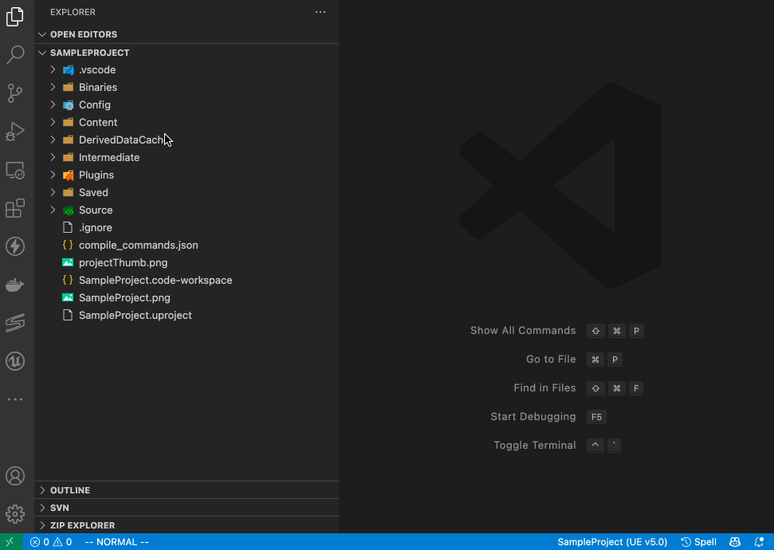
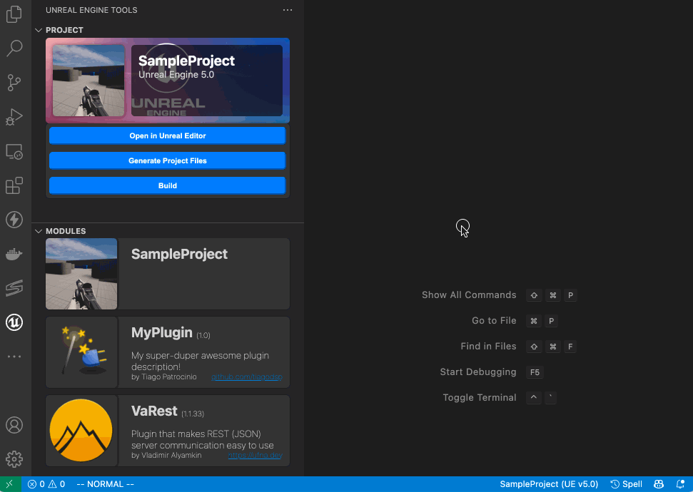
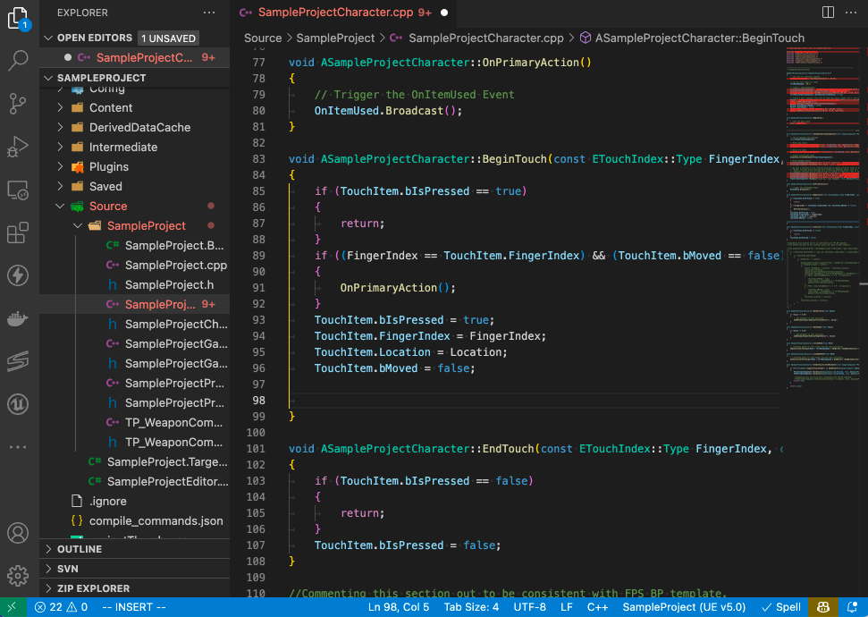

# Unreal Engine Tools

Unreal Engine Tools is an extension to Visual Studio Code with some shortcuts and code editor enhancements to improve the experience of developing C++ modules for Unreal Engine projects.

## Features

### Unreal Engine Tools in-editor section:
Section that provides some shortcuts and a overview of the current project in the Workspace.

### Build project from editor with Hot Reload:
Build shortcut that offers the engine installation selection and forces hot reload on editor.

It is possible to build individual modules too, also with hot reload.

### Improved code completion with Clangd extension:
Automatically invokes UnrealBuildTool in GenerateClangDatabase mode to generate the `compile_commands.json` file that is required by [Clangd extention](https://clangd.llvm.org), allowing the editor to have a better code completion experience. It is not perfect, but helps to get the job done. 🙌🏻

## Requirements

* `clangd` - For code improved completion experience.
* `MacOS` - Currently I am developed the extension in a Mac OS only, but as soon I get a Windows and Linux machine I will port it to Windows and Linux developing environment.

## Extension Settings
This extension contributes the following settings:

* `uetools.unrealEngineInstallationSearchPath`: Path to search for Unreal Engine installation for. Usually `C:\Program Files\Epic Games\` on Windows, or `/Users/Shared/Epic Games/` on Mac.

## Known Issues

* Currently support only Mac systems;
* Some code completion seems not work due to forward declaration of Unreal Engine classes and structs provided by `CoreMinimal.h`. I guess...;
* Still in development, so give it a try guys...

If you liked this project, feel free to suggest code, features and improvements. **Enjoy!**
